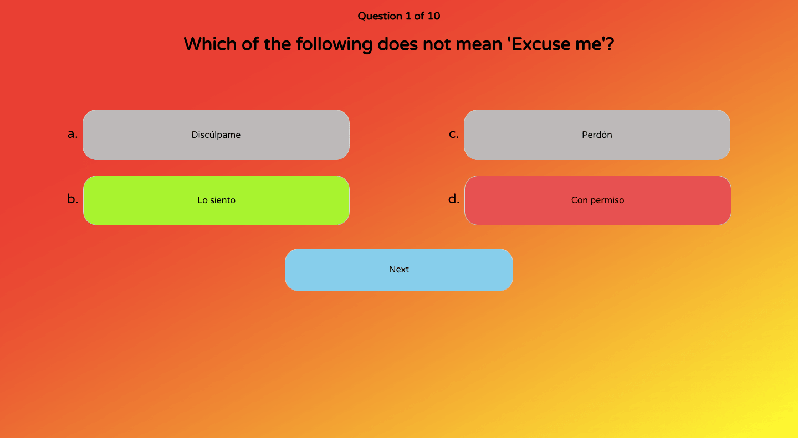
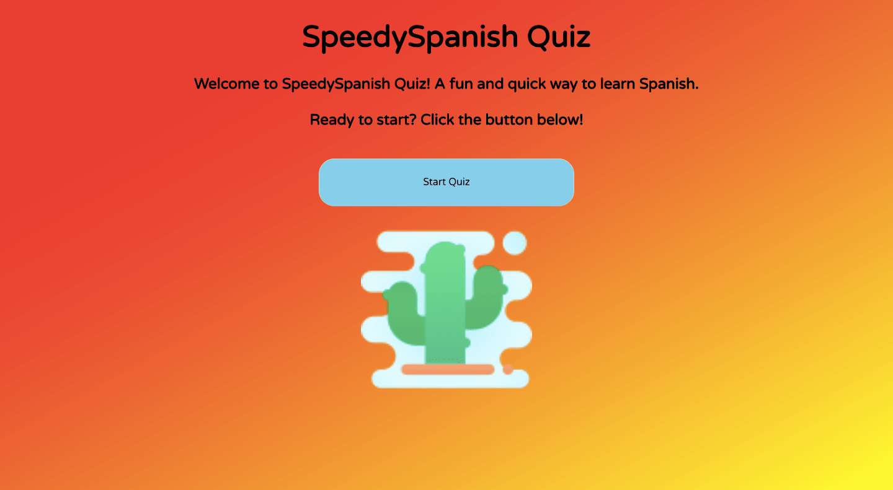

# SpeedySpanish - Quiz App

SpeedySpanish is a fun and simple Spanish learning quiz app built with React Hooks.

Questions are randomized at the beginning of each session, and users know immediately whether or not they answered correctly. At the end of each session a final Quiz Results page displays how users performed.



Visit this project at https://speedyspanishquiz.netlify.com/

## Technologies

HTML, CSS, React (Hooks)

## Setup

To run this project, fork or clone the repo and run `npm install` to install dependencies:

```
$ cd react-spanish-quiz
$ npm install
```
_Landing Page_
